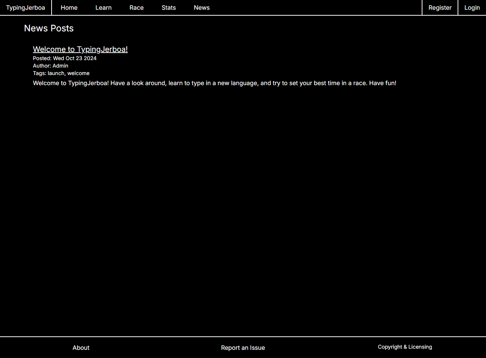

# TypingJerboa

[TypingJerboa.com](https://typingjerboa.com/)

# Building

Docker is required to be installed in order for building to succeed.

Dev: ``npm run dev:up``

Prod: ``npm run prod:up``

Test: ``npm run test:up``

# About

TypingJerboa is a website built for the purpose of teaching others how to type in a language that uses a unique script. Currently it supports Latin English and Russian Cyrillic.

TypingJerboa is built primarily with NextJS with TypeScript and runs in a Docker container.

There are two main modes offered in TypingJerboa: **Learn**, and **Race**.

The Learn section focuses on teaching a user where the characters for the selected language are located on the keyboard over many practice lessons. These lessons build on each other so that by the end, users will have the muscle memory to type just about anything in the selected language.

The Race section puts a users current typing ability to the test by requiring them to type out an entire paragraph in the selected language as quickly as possible. The words per minute and mistakes are displayed at the end of the race.

If you&apos;d like to keep track of your progress, it is possible and encouraged to register a completely free account, with no email necessary.

# Images

